# 🚀 Production RAG Pipeline with LangChain & FAISS

A complete, production-ready Retrieval-Augmented Generation (RAG) system built with modular Python architecture. This project demonstrates how to build a scalable document processing and intelligent question-answering system using modern AI tools.

## 🎯 Project Overview

This RAG pipeline provides:

- **Multi-format document processing** (PDF, TXT, CSV, Excel, Word, JSON)
- **Intelligent document chunking** with overlap for better context preservation
- **FAISS vector database** for efficient similarity search and persistence
- **Sentence Transformers** for high-quality embeddings
- **Groq LLM integration** for fast, accurate text generation
- **Modular architecture** with separate components for easy maintenance and scaling

## ✨ Key Features

### 🔄 **Complete RAG Workflow**

- **Document Ingestion**: Automatic loading of multiple file formats
- **Text Processing**: Smart chunking with configurable size and overlap
- **Vector Storage**: FAISS-based vector database with persistence
- **Semantic Search**: Similarity search with configurable top-k results
- **LLM Generation**: Context-aware response generation with Groq

### 🏗️ **Production Architecture**

- **Modular Design**: Separate components for data loading, embedding, vector storage, and search
- **Persistent Storage**: FAISS index and metadata saved to disk
- **Error Handling**: Comprehensive error handling across all components
- **Configurable Parameters**: Easy customization of chunk sizes, models, and search parameters
- **Environment Management**: UV-based dependency management

### 📚 **Multi-Format Support**

- **PDF Documents**: Using PyPDF and PyMuPDF loaders
- **Text Files**: Plain text document processing
- **Structured Data**: CSV, Excel, and JSON file support
- **Word Documents**: DOCX file processing
- **Metadata Preservation**: Source tracking and document metadata

## � Supported Document Types

| Document Type  | Extensions      | Loader Used               | Description                                    | Use Cases                                    |
| -------------- | --------------- | ------------------------- | ---------------------------------------------- | -------------------------------------------- |
| **PDF**        | `.pdf`          | `PyPDFLoader`             | Extracts text from PDF documents with metadata | Research papers, reports, manuals, books     |
| **Plain Text** | `.txt`          | `TextLoader`              | Direct text file processing                    | Code files, logs, documentation, notes       |
| **CSV**        | `.csv`          | `CSVLoader`               | Structured data with column headers            | Data exports, spreadsheets, databases        |
| **Excel**      | `.xlsx`, `.xls` | `UnstructuredExcelLoader` | Excel workbooks and spreadsheets               | Financial data, reports, structured datasets |
| **Word**       | `.docx`         | `Docx2txtLoader`          | Microsoft Word documents                       | Business documents, reports, articles        |
| **JSON**       | `.json`         | `JSONLoader`              | Structured JSON data                           | API responses, configuration files, datasets |

### **Document Processing Features**

- ✅ **Automatic Format Detection**: Based on file extensions
- ✅ **Metadata Extraction**: Source file, page numbers, timestamps
- ✅ **Error Handling**: Graceful handling of corrupted or unsupported files
- ✅ **Batch Processing**: Process entire directories at once
- ✅ **Content Validation**: Ensures non-empty content before processing
- ✅ **Encoding Support**: UTF-8 and various character encodings

## 🔄 RAG Pipeline Flow

```mermaid
graph TD
    A[📁 Document Sources] --> B[🔍 Document Loader]
    B --> C{📋 Format Detection}
    C --> D[📄 PDF Loader]
    C --> E[📝 Text Loader]
    C --> F[📊 CSV Loader]
    C --> G[📑 Word Loader]
    C --> H[🗂️ JSON Loader]
    C --> I[📈 Excel Loader]

    D --> J[📖 Raw Documents]
    E --> J
    F --> J
    G --> J
    H --> J
    I --> J

    J --> K[✂️ Text Chunking]
    K --> L[🧠 Embedding Generation]
    L --> M[🗄️ FAISS Vector Store]

    N[❓ User Query] --> O[🧠 Query Embedding]
    O --> P[🔍 Similarity Search]
    M --> P
    P --> Q[📋 Retrieved Contexts]
    Q --> R[🤖 LLM Generation]
    R --> S[✨ Final Answer]

    style A fill:#e1f5fe
    style S fill:#e8f5e8
    style M fill:#fff3e0
    style R fill:#f3e5f5
```



### **Pipeline Stages Explained**

#### **1. 📥 Document Ingestion**

```python
# Automatically detects and loads multiple formats
docs = load_all_documents("data/")
# Supports: PDF, TXT, CSV, Excel, Word, JSON
```

#### **2. ✂️ Text Chunking**

```python
# Smart chunking with overlap for context preservation
chunks = splitter.split_documents(documents)
# Default: 1000 chars with 200 char overlap
```

#### **3. 🧠 Embedding Generation**

```python
# High-quality embeddings using Sentence Transformers
embeddings = model.embed_documents([chunk.page_content for chunk in chunks])
# Model: all-MiniLM-L6-v2 (384 dimensions)
```

#### **4. 🗄️ Vector Storage**

```python
# Efficient storage and retrieval with FAISS
vectorstore.add_documents(chunks)
# Includes metadata and persistent storage
```

#### **5. 🔍 Semantic Search**

```python
# Query processing and similarity search
similar_docs = vectorstore.similarity_search(query, k=top_k)
# Returns most relevant document chunks
```

#### **6. 🤖 Answer Generation**

```python
# Context-aware response generation
response = llm.invoke(prompt_with_context)
# Uses Groq LLM with retrieved context
```

### **Data Flow Architecture**

```
┌─────────────────┐    ┌─────────────────┐    ┌─────────────────┐
│   Raw Documents │───▶│  Text Chunking  │───▶│   Embeddings    │
│                 │    │                 │    │                 │
│ • PDFs          │    │ • Smart Split   │    │ • 384D Vectors  │
│ • Text Files    │    │ • Overlap       │    │ • Normalized    │
│ • Structured    │    │ • Metadata      │    │ • Semantic      │
└─────────────────┘    └─────────────────┘    └─────────────────┘
         │                       │                       │
         ▼                       ▼                       ▼
┌─────────────────┐    ┌─────────────────┐    ┌─────────────────┐
│  Error Handling │    │  Chunk Metadata │    │ FAISS Index     │
│                 │    │                 │    │                 │
│ • Format Check  │    │ • Source Info   │    │ • Persistence   │
│ • Validation    │    │ • Page Numbers  │    │ • Fast Search   │
│ • Logging       │    │ • Timestamps    │    │ • Scalability   │
└─────────────────┘    └─────────────────┘    └─────────────────┘
```

### **Performance Characteristics**

| Stage                | Time Complexity | Memory Usage | Optimization Tips                       |
| -------------------- | --------------- | ------------ | --------------------------------------- |
| **Document Loading** | O(n) files      | Low          | Batch processing for large collections  |
| **Text Chunking**    | O(m) content    | Medium       | Adjust chunk size based on content type |
| **Embedding**        | O(k) chunks     | High         | Use lighter models for speed            |
| **Vector Storage**   | O(k log k)      | Medium       | FAISS handles large-scale efficiently   |
| **Search**           | O(log k)        | Low          | Increase top_k for better recall        |
| **Generation**       | O(context)      | Medium       | Optimize prompt length                  |

## �📁 Project Structure

```
langchain-rag/
├── src/                          # Core application modules
│   ├── __init__.py              # Package initialization
│   ├── data_loader.py           # Multi-format document loading
│   ├── embedding.py             # Text chunking and embedding generation
│   ├── vectorstore.py           # FAISS vector database management
│   └── search.py                # RAG search and summarization
├── notebook/                    # Jupyter notebooks for development
│   ├── document.ipynb           # Basic document processing examples
│   └── pdf_loader.ipynb         # Advanced RAG pipeline with ChromaDB
├── data/                        # Document storage
│   ├── text_files/              # Sample text documents
│   ├── pdf_files/               # PDF documents
│   └── [other formats]/         # CSV, Excel, Word, JSON files
├── faiss_store/                 # Persistent FAISS vector database
│   ├── faiss.index             # FAISS vector index
│   └── metadata.pkl             # Document metadata
├── app.py                       # Main application entry point
├── main.py                      # Alternative entry point
├── pyproject.toml               # Project configuration and dependencies
├── requirements.txt             # Package requirements
├── .env                         # Environment variables
└── README.md                    # This file
```

## 🛠️ Technology Stack

### **Core Libraries**

- **LangChain**: Document processing and text splitting
- **FAISS**: Vector similarity search and indexing
- **Sentence Transformers**: State-of-the-art embeddings
- **Groq**: Fast LLM inference
- **NumPy**: Numerical operations for embeddings

### **Document Processing**

- **PyPDF/PyMuPDF**: PDF document processing
- **python-docx**: Word document handling
- **pandas**: CSV and Excel file processing
- **json**: JSON document parsing

### **Development Tools**

- **UV**: Modern Python package management
- **Jupyter**: Interactive development environment
- **python-dotenv**: Environment variable management
- **Pydantic**: Configuration and data validation

## 📋 Prerequisites

- **Python 3.13+**: Latest Python version
- **UV Package Manager**: For dependency management
- **Groq API Key**: For LLM functionality
- **Git**: Version control

## 🚀 Installation & Setup

### 1. **Clone the Repository**

```bash
git clone https://github.com/aayushjainx/LangChain-RAG.git
cd langchain-rag
```

### 2. **Install UV (if not already installed)**

```bash
# macOS/Linux
curl -LsSf https://astral.sh/uv/install.sh | sh

# or via Homebrew
brew install uv
```

### 3. **Set up Python Environment**

```bash
# Create virtual environment with Python 3.13
uv venv --python 3.13

# Install dependencies
uv sync
```

### 4. **Environment Configuration**

Create a `.env` file in the project root:

```env
# Required: Groq API Key
GROQ_API_KEY=your_groq_api_key_here

# Optional: Other API keys (if you plan to extend the project)
OPENAI_API_KEY=your_openai_api_key_here
```

**Get Groq API Key:**

1. Visit [console.groq.com](https://console.groq.com)
2. Sign up/Sign in
3. Navigate to API Keys
4. Create new API key

### 5. **Prepare Your Documents**

Add your documents to the `data/` directory:

```bash
data/
├── text_files/          # .txt files
├── pdf_files/           # .pdf files
├── csv_files/           # .csv files
├── excel_files/         # .xlsx files
├── word_files/          # .docx files
└── json_files/          # .json files
```

## 🏃‍♂️ Quick Start

### **Method 1: Using UV (Recommended)**

```bash
# Run the main application
uv run python app.py

# Or run with main.py
uv run python main.py
```

### **Method 2: Activate Virtual Environment**

```bash
# Activate environment
source .venv/bin/activate  # Linux/macOS
# .venv\Scripts\activate    # Windows

# Run application
python app.py
```

### **Method 3: Jupyter Notebooks**

```bash
# Start Jupyter
uv run jupyter notebook

# Open notebooks for interactive development
# - notebook/document.ipynb (basic examples)
# - notebook/pdf_loader.ipynb (advanced pipeline)
```

## 🔧 Core Components

### 1. **Document Loader (`src/data_loader.py`)**

```python
from src.data_loader import load_all_documents

# Load all supported documents from data directory
docs = load_all_documents("data")
print(f"Loaded {len(docs)} documents")
```

**Supported Formats:**

- PDF (`.pdf`) - via PyPDFLoader
- Text (`.txt`) - via TextLoader
- CSV (`.csv`) - via CSVLoader
- Excel (`.xlsx`) - via UnstructuredExcelLoader
- Word (`.docx`) - via Docx2txtLoader
- JSON (`.json`) - via JSONLoader

### 2. **Embedding Pipeline (`src/embedding.py`)**

```python
from src.embedding import EmbeddingPipeline

# Initialize embedding pipeline
emb_pipeline = EmbeddingPipeline(
    model_name="all-MiniLM-L6-v2",
    chunk_size=1000,
    chunk_overlap=200
)

# Process documents
chunks = emb_pipeline.chunk_documents(documents)
embeddings = emb_pipeline.embed_chunks(chunks)
```

### 3. **Vector Store (`src/vectorstore.py`)**

```python
from src.vectorstore import FaissVectorStore

# Initialize FAISS vector store
vectorstore = FaissVectorStore(
    persist_dir="faiss_store",
    embedding_model="all-MiniLM-L6-v2"
)

# Build from documents (first time)
vectorstore.build_from_documents(documents)

# Load existing store
vectorstore.load()

# Query the store
results = vectorstore.query("What is machine learning?", top_k=5)
```

### 4. **RAG Search (`src/search.py`)**

```python
from src.search import RAGSearch

# Initialize RAG system
rag = RAGSearch(
    persist_dir="faiss_store",
    embedding_model="all-MiniLM-L6-v2",
    llm_model="llama-3.1-8b-instant"
)

# Search and generate summary
query = "What is machine learning?"
summary = rag.search_and_summarize(query, top_k=3)
print("Summary:", summary)
```

## 💡 Usage Examples

### **Basic RAG Workflow**

```python
from src.data_loader import load_all_documents
from src.vectorstore import FaissVectorStore
from src.search import RAGSearch

# 1. Load documents
docs = load_all_documents("data")

# 2. Initialize and build vector store (first time only)
vectorstore = FaissVectorStore("faiss_store")
vectorstore.build_from_documents(docs)

# 3. Initialize RAG search
rag_search = RAGSearch()

# 4. Query the system
query = "What are the key features of Python?"
summary = rag_search.search_and_summarize(query, top_k=3)
print("Answer:", summary)
```

### **Advanced Usage**

```python
# Custom configuration
rag = RAGSearch(
    persist_dir="custom_store",
    embedding_model="all-mpnet-base-v2",  # Different embedding model
    llm_model="llama-3.1-70b-versatile"   # Different LLM model
)

# Multi-query processing
queries = [
    "What is machine learning?",
    "How does Python handle data science?",
    "What are the applications of AI?"
]

for query in queries:
    result = rag.search_and_summarize(query, top_k=5)
    print(f"Q: {query}")
    print(f"A: {result}\n")
```

## ⚙️ Configuration Options

### **Embedding Models** (via Sentence Transformers)

- `all-MiniLM-L6-v2` (default) - Fast, good quality
- `all-mpnet-base-v2` - Higher quality, slower
- `all-distilroberta-v1` - Balanced performance

### **LLM Models** (via Groq)

- `llama-3.1-8b-instant` (default) - Fast inference
- `llama-3.1-70b-versatile` - Higher quality
- `mixtral-8x7b-32768` - Alternative model
- `gemma2-9b-it` - Compact model

### **Text Chunking Parameters**

- `chunk_size`: Size of text chunks (default: 1000)
- `chunk_overlap`: Overlap between chunks (default: 200)
- `separators`: Text splitting separators

## 🧪 Development & Testing

### **Running Tests**

```bash
# Add pytest for testing
uv add --dev pytest

# Run tests
uv run pytest
```

### **Code Formatting**

```bash
# Add development tools
uv add --dev black isort flake8

# Format code
uv run black src/
uv run isort src/

# Lint code
uv run flake8 src/
```

### **Adding New Dependencies**

```bash
# Add new package
uv add package-name

# Add development dependency
uv add --dev package-name

# Update requirements
uv export --no-hashes > requirements.txt
```

## 🔍 Monitoring & Debugging

The application provides detailed logging:

- `[INFO]` - General information and progress
- `[DEBUG]` - Detailed debugging information
- `[ERROR]` - Error messages and stack traces

### **Common Issues & Solutions**

1. **ModuleNotFoundError**: Use `uv run python app.py` instead of `python app.py`
2. **API Key Issues**: Ensure `.env` file contains valid `GROQ_API_KEY`
3. **Memory Issues**: Reduce `chunk_size` or process fewer documents
4. **Empty Results**: Check if documents are in the correct `data/` subdirectories

## 📈 Performance Optimization

### **For Large Document Collections**

- Use smaller chunk sizes (500-800)
- Consider `all-MiniLM-L6-v2` for faster embeddings
- Implement batch processing for very large collections

### **For Better Quality**

- Use `all-mpnet-base-v2` embeddings
- Increase chunk overlap (300-400)
- Use `llama-3.1-70b-versatile` for generation

## 🤝 Contributing

1. Fork the repository
2. Create feature branch (`git checkout -b feature/amazing-feature`)
3. Commit changes (`git commit -m 'Add amazing feature'`)
4. Push to branch (`git push origin feature/amazing-feature`)
5. Open a Pull Request

## 📄 License

This project is licensed under the MIT License - see the [LICENSE](LICENSE) file for details.

## 🙏 Acknowledgments

- **LangChain** - Document processing framework
- **FAISS** - Efficient similarity search
- **Sentence Transformers** - High-quality embeddings
- **Groq** - Fast LLM inference
- **UV** - Modern Python package management

## 📞 Support

- **Documentation**: Check component docstrings and code comments
- **Issues**: Open GitHub issues for bugs or feature requests
- **API Documentation**:
  - [LangChain](https://docs.langchain.com/)
  - [FAISS](https://faiss.ai/)
  - [Sentence Transformers](https://www.sbert.net/)
  - [Groq](https://console.groq.com/docs)

---

**🎉 Happy coding!** Build amazing RAG applications with this production-ready pipeline!
